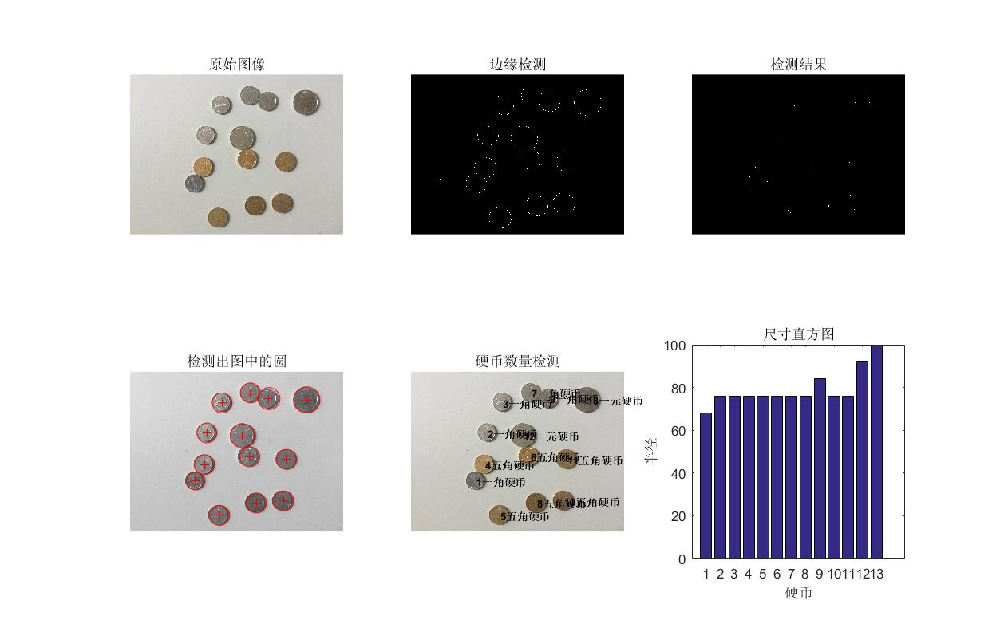

# Coin_Detector
One of the image processing experiments

Function
-------
The number and type of coins are detected by Hough transform and pixel detection

    

Contact
-------
If you have any questions, please contact me（403500543@qq.com）
[My Blog](http://vampon.club "VAM")
